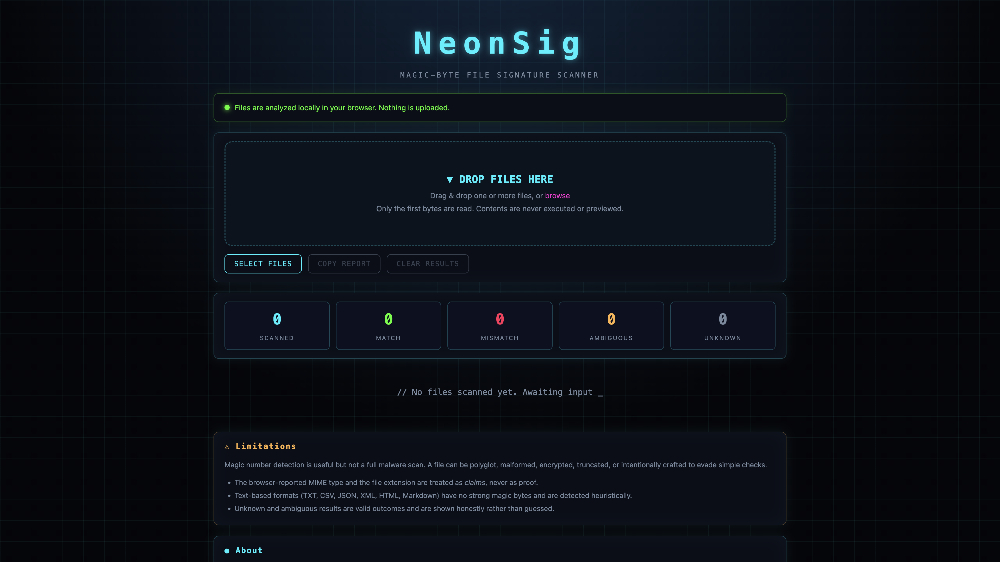
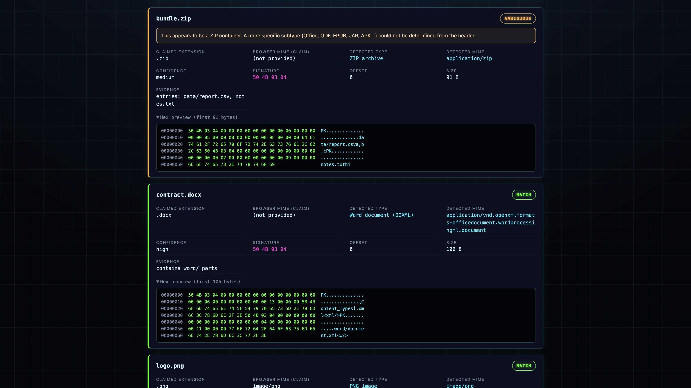
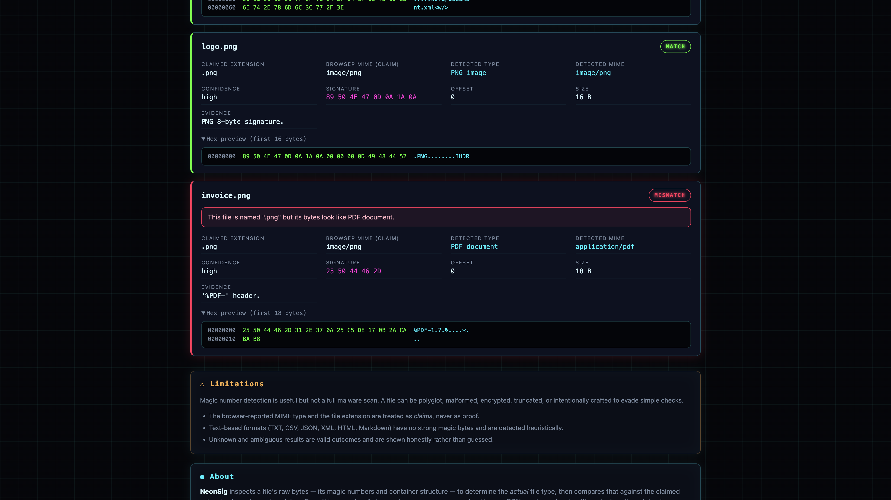
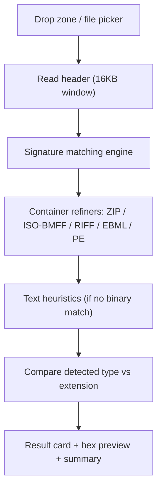

# NeonSig

**Magic-byte file signature scanner** — a cyberpunk-themed, fully client-side tool that identifies the *actual* type of a file by inspecting its raw bytes, then compares that against the file's extension to flag mismatches.

Everything runs locally in your browser. **No server, no tracking, no CDN, no dependencies.** It's a single self-contained `index.html`.

**[Live demo →](https://atahan99.github.io/NeonSig/)**

<p align="center">
  
</p>

## Why

A file's extension and the browser-reported MIME type are just *claims*. A `.png` can secretly be a PDF; a `.pdf` can be a Windows executable. NeonSig reads the leading bytes of a file (up to a 16 KB header window), matches them against known signatures and container structures, and tells you what the file **really** is — while being honest about uncertainty.

## Features

- **Magic-byte detection** for 40+ formats: images, documents, archives, audio, video, executables, fonts, databases, and more.
- **Container-aware refinement** — doesn't just say "ZIP":
  - OOXML (`.docx` / `.xlsx` / `.pptx`) via internal part names
  - ODF (`.odt` / `.ods` / `.odp`) and EPUB via the stored `mimetype`
  - APK (`AndroidManifest.xml`) and JAR (`META-INF/MANIFEST.MF`)
  - ISO-BMFF `ftyp` brands → MP4 / MOV / HEIC / AVIF / M4A
  - RIFF form types → WAV / AVI / WebP
  - EBML DocType → WebM vs MKV
  - PE header parsing → Windows EXE vs DLL
- **Honest verdicts:** `MATCH` / `MISMATCH` / `AMBIGUOUS` / `UNKNOWN`, with human-readable warnings.
- **Drag-and-drop** plus a file-picker fallback, multi-file support.
- **Hex preview** of the first 128 bytes with an ASCII column.
- **Copy JSON report** and **clear results** with one click.
- **Summary counters:** scanned / match / mismatch / ambiguous / unknown.
- **Privacy-first:** files are never uploaded, executed, rendered, or embedded — only their bytes are inspected.
- **Zero dependencies:** inline HTML, CSS, and JS. Works offline by opening the file directly.

## Screenshots

| Scan results | Extension mismatch |
| --- | --- |
|  |  |

## Usage

### Option 1 — just open it

Download or clone the repo and open `index.html` in any modern browser (Chrome, Edge, Firefox, Safari). No build step, no server.

```bash
git clone https://github.com/atahan99/NeonSig.git
cd NeonSig
open index.html        # macOS
# or: xdg-open index.html   (Linux) / start index.html (Windows)
```

### Option 2 — serve locally

Some browsers restrict certain APIs on `file://`. Serving over HTTP avoids any such quirks:

```bash
python3 -m http.server 8000
# then visit http://localhost:8000
```

Drag files onto the drop zone (or click **Select files**). Each file is analyzed and rendered as a result card. Use **Copy report** to grab a JSON summary.

## How it works



1. Only a bounded header window is read via `Blob.slice().arrayBuffer()`, so huge files are handled without loading them fully.
2. A local signature registry matches magic numbers at defined offsets (with optional bitmasks for variable fields).
3. Container refiners inspect internal structure to narrow broad matches to specific subtypes.
4. When nothing binary matches, conservative text heuristics classify text formats (SVG, HTML, XML, JSON, CSV, Markdown, plain text) at low confidence.
5. The detected type is compared to the extension to produce a status and a plain-English warning.

## The verdicts

| Status | Meaning |
| --- | --- |
| **MATCH** | The extension is one of the expected extensions for the detected type. |
| **MISMATCH** | The detected type is strong and the extension does not fit (e.g. a PDF named `.png`). |
| **AMBIGUOUS** | The type is a broad/container format whose specific subtype could not be confirmed. |
| **UNKNOWN** | No reliable signature or heuristic matched (unsupported, empty, encrypted, or truncated). |

## Limitations

Magic-number detection is useful but **not a full malware scan**. A file can be polyglot, malformed, encrypted, truncated, or intentionally crafted to evade simple checks. The browser-reported MIME type and the extension are treated as claims, never as proof. Unknown and ambiguous results are valid outcomes and are shown honestly rather than guessed.

## Supported formats (selection)

- **Images:** PNG, JPEG, GIF, WebP, BMP, TIFF, ICO/CUR, SVG, AVIF, HEIC/HEIF
- **Documents:** PDF, RTF, legacy MS Office (OLE/CFB), DOCX/XLSX/PPTX, ODT/ODS/ODP, EPUB
- **Archives:** ZIP, JAR, APK, RAR (v4/v5), 7z, GZIP, BZIP2, XZ, TAR
- **Audio:** MP3 (ID3 + frame sync), WAV, FLAC, OGG, MIDI, M4A/AAC
- **Video:** MP4/MOV/3GP, AVI, MKV/WebM, MPEG
- **Executables:** Windows PE (EXE/DLL), ELF, Mach-O, Java class, WebAssembly
- **Fonts:** WOFF, WOFF2, TTF, OTF
- **Other:** SQLite database

## Contributing

Issues and pull requests are welcome. Adding a format is usually just a new entry in the signature registry inside `index.html`.

## License

[MIT](LICENSE) © atahan99
